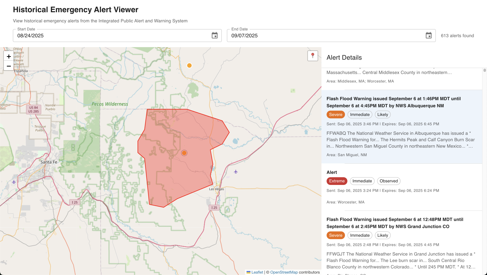

# Historical Emergency Alert Viewer

A Next.js application for viewing historical emergency alerts from FEMA's Integrated Public Alert and Warning System (IPAWS).

## Features

- **Interactive Map**: View emergency alerts on an interactive Leaflet map with OpenStreetMap tiles
- **Date Range Selection**: Filter alerts by date range using MUI date pickers (default: last 14 days)
- **Alert Visualization**: 
  - Color-coded markers based on severity (Extreme, Severe, Moderate, Minor)
  - Boundary polygons drawn for selected alerts
  - Click markers to view detailed alert information
- **Alert Details Panel**: 
  - Scrollable list of all alerts in the selected date range
  - Auto-scroll to selected alert
  - Detailed information including severity, urgency, certainty, and affected areas
- **Real-time Updates**: Automatically fetches alerts when date range changes

## Tech Stack

- **Frontend**: Next.js 15, React 19, TypeScript
- **Mapping**: Leaflet with react-leaflet
- **UI Components**: Material-UI (MUI) with MUI X Date Pickers
- **Data Fetching**: Axios for FEMA IPAWS API integration
- **Date Handling**: date-fns
- **Styling**: Tailwind CSS for base styles, MUI theme for components
